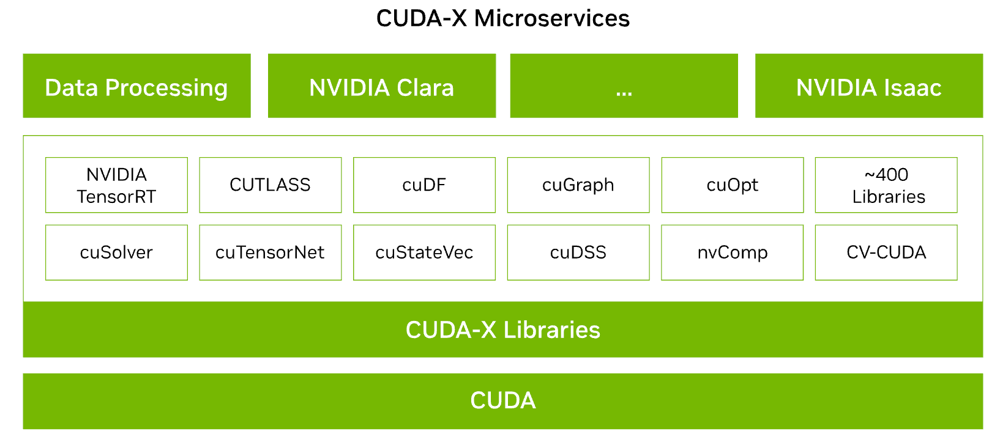
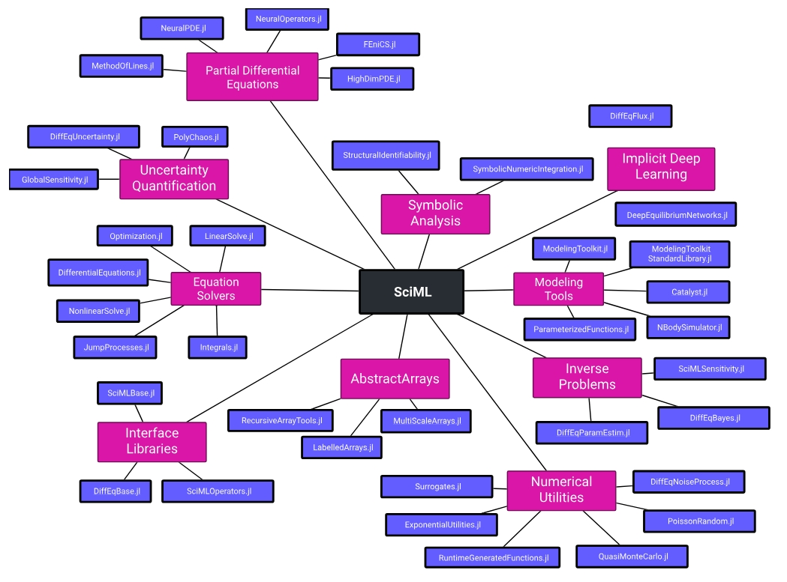
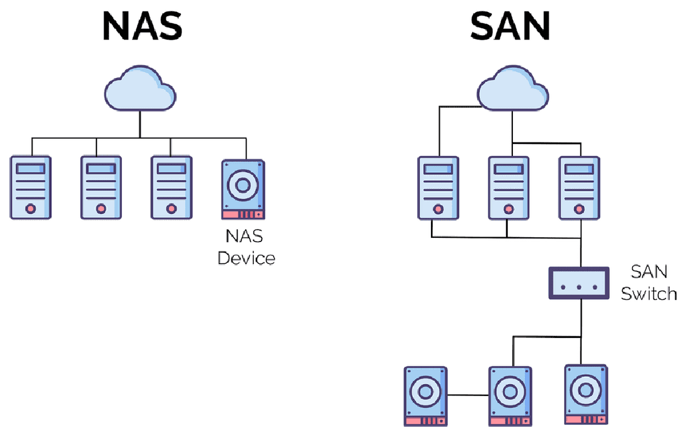
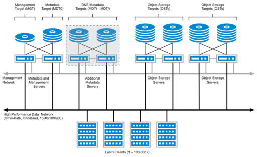

<!--Copyright © ZOMI 适用于[License](https://github.com/Infrasys-AI/AIInfra)版权许可-->

# HPC 软件与应用发展趋势

Author by: 陈悦孜

第二章简要介绍了高性能计算的硬件内容后，在这里的第三章我们介绍高性能计算软件与应用发展趋势。

高性能基础软件发展历程和未来趋势部分的内容将介绍编译器与运行时、计算库、通信中间件、存储系统、调度系统五个部分的子内容。对于应用软件，我们会介绍整体发展历程和具体行业应用趋势。

## 基础软件

高性能计算基础软件是连接硬件与应用的核心桥梁。基础软件发展历程围绕资源高效调度、数据高速流动、计算极致优化这些目标展开，主要分为调度、存储、通信、编译、计算库及基础算法六大维度。

## 编译器与运行时：从手动优化到自动代码生成

在 AI 集群基础软件领域中，编译器和运行时系统是支撑高效计算、资源管理和性能优化的核心组件。编译器在 AI 集群中负责将高级代码（如 Python/PyTorch/TensorFlow）转换为底层硬件（如 GPU/TPU/ASIC）可执行的高效代码，同时进行深度优化；运行时系统管理程序执行期间的动态行为，确保计算任务高效利用集群资源。

### 发展历程：传统编译器（1980s-2000s）

#### Fortran 主导 ：Intel Fortran Compiler、PGI Compiler 通过向量化和循环展开提升性能

Fortran 诞生于 20 世纪 50 年代，由约翰·巴科斯（John W. Backus）及其团队提出，用于替代用户使用的汇编语言，帮助用户使用高级编程语言，并使其能达到接近手工编码汇编语言的性能，大大简化用户编程量。

图为巴科斯和 Fortran。

Fortran 发展到后期，有很多公司基于 Fortran 也推出了自己的 Fortran 编译器产品。

Intel Fortran 编译器是英特尔开发的编译器，有支持 Windows 系统和 Linux 系统版本。Windows 系统版本的 Intel Fortran 是英特尔公司从惠普买来的在 Windows 平台从 CVF 6.6.C 之后 Fortran 编译器相关权利后开发的，在微软 Visual Studio 外壳的支持下实现 Visual IDE 功能。CVF 代表 Compact Visual Fortran，是一种紧凑型的视觉编程工具或接口的技术。Intel Fortran 编译器也有支持 Linux 的版本。Intel Fortran 编译器是 Intel Math Kernel Library 的一部分，专为 Intel 处理器优化。它提供了高性能的编译和调试工具，能够生成高效的机器代码，尤其在处理大规模数值计算时表现优异。

PGI 编译器是 Portland Group 提供的 Fortran 编译器。Portland Group (也称作 PGI ) 是领先的软件供应商，提供用于并行运算的编译器与工具。PGI 编译器为 Intel 和 AMD 64-位 x86 CPU 进行大幅度优化，并提供针对 NVIDIA GPU Accelerator 的广泛支持与优化。其中用到的 PGI Unified Binary 技术确保利用 PGI 编译器构建而成的应用程序能够在基于 Intel 或 AMD CPU 的系统上正确高效地执行，并在可用时能够动态地检测与使用 NVIDIA GPU Accelerator。PGI 编译器是针对高性能计算优化的编译器，支持多种 Fortran 标准，并提供了一些高级特性，如自动向量化、高级循环优化等。

#### OpenMP 初现 ：1997 年推出共享内存并行编程模型，支持多线程优化。

随着数据处理需求激增，并行计算倒逼编译器发展。1997 年 10 月发布的 OpenMP for Fortran 1.0 是初代跨平台共享内存方式的多线程并发编程模型，从此宣告 OpenMP 的出现。

OpenMP（Open Multi-Processing）由 OpenMP Architecture Review Board 牵头提出的，并已被广泛接受的，用于共享内存并行系统的多线程程序设计的一套指导性注释（Compiler Directive）。它是一套支持跨平台共享内存方式的多线程并发的编程 API，使用 C,C++和 Fortran 语言，可以在大多数的处理器体系和操作系统中运行，包括 Solaris, AIX, HP-UX, GNU/Linux, Mac OS X, 和 Microsoft Windows。包括一套编译器指令、库和一些能够影响运行行为的环境变量。OpenMP 采用可移植的、可扩展的模型，为程序员提供了一个简单而灵活的开发平台，从标准桌面电脑到超级计算机的并行应用程序接口。混合并行编程模型构建的应用程序可以同时使用 OpenMP 和 MPI，或更透明地通过使用 OpenMP 扩展的非共享内存系统上运行的计算机集群。

通俗语言来讲，OpenMP 实现跨平台的多线程，主线程(顺序的执行指令)生成一系列的子线程，并将任务划分给这些子线程进行执行。这些子线程并行的运行，由运行时环境将线程分配给不同的处理器。

### 发展历程：异构编译时代（2010s-至今）

2010 年之后，AI 的出现使得并行计算性能要求大幅度提升，CPU 不能满足低延迟、高计算的需求，于是 GPU 和异构计算在并行计算里发挥重要作用，异构编译时代开启一直到现在。

#### CUDA 和 OpenCL：NVIDIA NVCC 实现 CUDA 代码生成，OpenCL 支持跨厂商异构设备。

GPU 已成为高性能计算程序必可不少的一部分。GPGPU（通用 GPU）使用图形处理器（GPU）进行通用计算。GPGPU 编程的原理是在不同的处理器之间划分多个进程或单个进程，以加快完成速度。这里就需要并行计算框架来实现 GPU 加速运算让 CPU 和 GPU 协同处理大规模数据。GPGPU 利用 OpenCL 和 CUDA 等并行计算加速软件，使得 GPU 借助数百个片上处理器核高效实现并行计算，实现这些多核处理器互相通信和协作，解决复杂的计算问题。

CUDA 和 OpenCL 是用于 GPU 加速计算的异构计算框架，用于编写和管理异构系统（如 CPU+GPU/FPGA 等）的并行计算任务。

CUDA 是统一计算设备架构（Compute Unified Device Architecture）的代表，这个架构是 NVIDIA 于 2007 年发布的并行编程范例。CUDA 使用类 C 语言，用于开发图形处理器软件和大量 GPU 通用应用程序，这些应用程序本质上是可以高度并行开发。CUDA 是一种专有 API，因此仅支持基于 Tesla 体系结构的 NVIDIA GPU。CUDA 依赖 Nvidia 提供的运行时编译器 NVCC 实现设备代码编译为特定硬件指令。

NVCC（NVIDIA CUDA Compiler）是 NVIDIA 提供的 CUDA 代码编译器，其编译过程分为 主机（Host）代码 和 设备（Device）代码 两部分，流程如下：

1. 代码分离：NVCC 首先将 CUDA 代码（.cu 文件）中的主机代码（C/C++）和设备代码（GPU 核函数）分离。
2. 主机代码编译：主机代码由主机编译器（如 GCC、MSVC）编译生成目标平台的 CPU 汇编（如 x86、ARM），最终链接为可执行文件。
3. 设备代码处理：设备代码由 NVCC 转换为 PTX（虚拟 GPU 指令）或直接通过 JIT 编译器生成目标 GPU 的 SASS 指令（如 NVIDIA Ampere/Turing 架构）。
4. 运行时整合：执行时，主机代码调用 GPU 核函数，PTX 或 SASS 指令由 GPU 驱动动态加载到显卡执行。

图中展示 CUDA 代码生成分层的流程：主机代码走传统编译路径（CPU），设备代码通过 NVCC 和 JIT 编译生成 GPU 可执行指令，最终实现 CPU-GPU 协同计算。

OpenCL 是开放计算语言的缩略词，由苹果公司和 Khronos 集团推出，旨在为异构计算提供一个基准，突破 NVIDIA GPU 的限制。OpenCL 为 GPU 编程提供了一种可移植语言，使用了 CPU、GPU、数字信号处理器等。这种可移植语言用于设计程序或应用程序，让程序具有足够的通用性，可以在迥异的体系结构上运行，同时保持足够的适应性，提升每个硬件平台的性能。OpenCL 依赖 clBuildProgram 在运行时编译内核代码（动态生成设备二进制），但开发者仍需手动管理异构逻辑。

#### SYCL 和 oneAPI：基于 C++ 的 SYCL 编译器实现一次编写，多架构运行。

oneAPI 是英特尔（Intel）推出的一个编程模型和工具集合，旨在简化跨多种处理器架构的软件开发。它是一个统一的、开放的、标准化的编程环境，可用于编写并行代码，覆盖了 CPU、GPU、FPGA 等不同类型的处理器。通过 oneAPI，开发人员可以使用相同的代码库来针对不同的硬件进行优化，并实现更高的性能和更好的可移植性。oneAPI 一个重要的特性是开放性，支持多种类型的架构和不同的硬件供应商，是一种统一的编程模型。使得开发人员拥有可以选择最佳硬件来做加速计算的自由，不用锁定某些厂商专有的硬件即可提高软件的开发生产力，并且获得与硬件加速设备相匹配的性能。

下图展示英特尔 oneAPI 工具的组成以及应用。oneAPI 支持两种编程模型，所示第一种是直接编程（Direct Programming）有统一的编程语言 SYCL，它是基于 C++标准的编程语言。另一种是基于库的编程（API-Based Programming）。对于 Level 0，这个跟硬件加速设备打交道的层上，如果硬件厂商实现了这层接口，那么它的设备就可以被 oneAPI 上层的框架使用。

SYCL（异构编程标准）代表了一项行业标准化工作，包括对 c++数据并行编程的支持，被概括为“面向 OpenCL 的 c++单源异构编程”。SYCL 是一个基于 OpenCL 的跨平台的抽象层，它使异构处理器的代码能够使用 c++以“单一源”风格编写，使编译器能够分析和优化整个程序，而不管代码要在哪个设备上运行。它包含模板与 lambda 函数，便于高级应用程序编码。与 OpenCL 相比，SYCL 提供了更高级别的抽象和更简洁的编程接口。 数据并行 C++是 oneAPI 对 SYCL 编译器的实现，结合现代 C++生产力与 SYCL 标准，实现数据并行性与异构编程。DPC++还通过简化编码、减少冗长与优化性能来提高生产力。

下图展示 SYCL 是一个标准化工作，有多个编译器可以在 C++和 SYCL 中使用，包括来自 Codeplay、华为、英特尔和海德堡大学的实现。这些编译器支持使用 C++和 SYCL 编写的代码，并可以针对各种后端进行优化，包括 CPU 和 AMD、Intel、NVIDIA 等 GPU。

oneAPI 的体系架构为开发者提供了一个统一、开放、标准化的多架构软件开发环境，支持多种处理器和硬件供应商。 SYCL 作为 oneAPI 的直接编程语言，为 C++数据并行编程提供了行业标准化的支持，简化了异构编程的复杂性，并提高了编程的生产力和性能。

下图展示 oneAPI 和 SYCL 更详细的生态位置和相关的软件栈。

#### 国产突破：华为毕昇编译器优化鲲鹏 CPU 与昇腾 GPU 异构计算。

眼光放到中国，毕昇编译器是华为公司自主研发的高性能编译器工具链，首版于 2020 年 9 月 30 日发布，专为鲲鹏 920 处理器架构深度优化。该编译器基于开源 LLVM 框架开发，支持 C、C++和 Fortran 编程语言，通过内存优化增强、自动矢量化等先进编译算法提升代码执行效率，结合鲲鹏 Neon/Sve/Sme 等内嵌指令技术，深度优化指令流水线及指令调度算法，发挥鲲鹏架构的最佳表现。下图为毕昇编译器的组成和支持情况。

截至 2025 年 5 月，已迭代至 4.2.0.1 补丁版本，兼容 openEuler、CentOS、Ubuntu 等多种主流操作系统。在气象、安防等高性能计算领域，其性能表现显著优于 GCC 编译器。

2022 年华为还推出了支持多样算力编程的毕昇 C++语言，实现鲲鹏与昇腾 AI 算力的协同优化。毕昇 C++编程语言以 C++为基础，支持多样性计算的异构编程标准，实现使用一种语言即可对鲲鹏、昇腾 AI 等业界主流算力进行编程，大大降低了多样性计算系统的编程复杂性和学习成本。此外，毕昇 C++编程语言在支持通用语言规范的同时，还提供了统一矩阵编程、内存数据移动及向量化编程接口等扩展。毕昇融合编译器实现了鲲鹏、昇腾 AI 等多算力的融合统一编译优化。通过编译算法优化及与处理器架构深度协同，加强了自动向量化、循环优化和多面体优化等能力，标准 Benchmark 峰值性能提升 30%。当前毕昇 C++编程语言结合毕昇编译器，已与 10 多所高校研究机构在开展飞机噪声仿真、湍流仿真、地震模拟等多领域多样算力应用开发。基于鲲鹏加昇腾 AI 多样性计算架构实现了飞机噪声仿真，并实现开发效率翻倍提升，10+倍混合精度求解性能提升。

CANN 异构计算架构下毕昇编译器提供异构编程编译能力。

### 未来趋势

AI 编译器未来发展有以下三个趋势。AI 驱动自动调优通过机器学习生成最优的计算方法，提升计算效率；多级中间层表示的设计实现跨架构代码转换，降低编译器开发成本，使得多种不同硬件平台兼容更高效轻松；新兴流行的编程方式 Triton 进一步降低开发者开发 GPU 程序的学习成本。

#### AI 驱动自动调优 ：TVM、Ansor 等通过机器学习算法自动生成最优计算内核。

为了以一种高效的方式在各种硬件平台上提供这些算子，已经引入了多种编译器技术，用户使用高层级声明性语言以类似于数学表达式的形式定义计算，编译器根据该定义生成优化的张量程序。从高层定义中自动生成高性能张量程序是非常困难的。根据目标平台的架构，编译器需要在一个非常大和复杂的空间中进行搜索，其中包含优化的组合选择（例如，分块、向量化、并行化，不同的组合导致的程序性能差异极大）。寻找高性能的程序需要搜索策略来覆盖一个全面的空间，并有效地探索它。

这一过程称为自动调优，指在编译过程中，编译器或相关工具自动调整和优化代码的执行参数，以提高程序在特定硬件上的运行效率。这通常涉及到对算法、内存访问模式、并行度等多个方面的优化。自动调优的目的是减少人工干预，使得程序能够自动适应不同的硬件环境和运行条件。在 AI 领域，这尤为重要，因为 AI 模型的计算复杂度通常很高，而且不同的硬件平台（如 CPU、GPU、FPGA 等）对计算和内存访问的优化需求各不相同。

自动调优的过程通常包括以下几个步骤：

1. 性能分析：通过分析程序的运行情况，识别性能瓶颈和优化机会。
2. 参数搜索：系统地探索不同的编译选项和运行参数，寻找最佳的配置。
3. 性能评估：对不同的配置进行测试，评估其对性能的影响。
4. 反馈学习：根据性能评估的结果，调整搜索策略，进一步优化参数选择。

自动调优可以显著提高 AI 应用的运行效率，尤其是在深度学习等计算密集型任务中。然而，由于 AI 应用的多样性和复杂性，自动调优仍然是一个活跃的研究领域，研究人员和工程师们正在不断探索更高效、更智能的调优方法。在自动调优中，TVM 是走在前列的 AI 编译器，其自动调优系统已经历经三代，这里简单介绍 TVM 的这三代自动调优系统。

AutoTVM 是 TVM 的第一代自动调优系统，其是基于模板的。AutoTVM 是基于模板的 tuner，对于每一个需要调优的算子，需要使用 TVM 的 DSL 编写调优的 knob，例如循环展开的因子、循环重排序的顺序等。首先先编写模板，然后指定任务指定待调优的算子，如 resnet18 中所有的 conv2d，TVM 会根据事先编写的 conv2d 模板生成调度搜索空间。第三步指定调优参数：AutoTVM 有多个 tuner，根据 index 的 random tuner 和 grid tuner、基于遗传算法的 ga tuner、基于 Xgb 的 XGBTuner。tuner 影响的是对调度搜索空间的探索，搜索空间是巨大的难以穷举的，通过 tuner 来高效搜索相对更优的调度候选项。最后进行性能评估。对于 XGBTuner 这个具有 cost module 的 tuner，调度候选项在硬件上测量之前会使用模型预测相对性能，选出相对优的一批再去运行，这样减少真实测量的次数，减少调优时间。下图演示这个流程。

AutoTVM 需要事先编写模板来组成调度的搜索空间，最佳性能的上限取决于模板的设计，这对模板的编写带来了很高的要求。作为第二代调优系统，Ansor（Auto Scheduler）取消了模板机制，优化过程可以自动、无干预的进行：无需手动指定优化方式，编译器自动应用调度原语。Ansor 自动生成一个覆盖全面的优化的大搜索空间，并为空间中的每个张量程序提供被选择的机会。首先，它自动构建一个大的搜索空间，以覆盖给定计算定义的尽可能多的张量程序。其次，在大搜索空间中高效搜索，该搜索空间可能比现有模板可以覆盖的范围大几个数量级。最后，在优化具有许多子图的整个 DNN 时，识别对端到端性能至关重要的子图并对其进行优先级排序，因为资源是有限的，应该将调优时间和算力资源分配给对性能有更大影响的子图。

Meta Schedule 是第三代调优系统，提供以下特性：

1.用于实现手动调优、AutoTVM 风格和 AutoScheduler 风格的统一 API。

2.所有调度原语的可扩展性，包括张量化和循环分块。在自动调优中使用新的原语几乎不需要额外的努力。

3.自动化基础设施在其每个组件上都是可扩展的。每个组件的系统可以在纯 python 或 C++或两者中轻松自定义。例如，可以开发一个新的在 python 中的调度空间生成器或者新的 ProgramRunner 等。

Meta Scheduler 遵循下图的调优流程：

首先生成设计空间，底层系统记录了用户使用的所有调度原语，以及在采样指令上做出的随机决策，称为 Trace。Trace 可能包含零条或多条采样指令，这些指令引入调度中的不确定性，形成了一个可供探索的设计空间，例如哪一组分块大小在特定硬件上效果最佳。然后探索设计空间，Meta Schedule 提供了多种内置的探索策略，可以详尽或高效地进行搜索 ，来实现高效的调度。其搜索策略与之前调优器的搜索策略类似，可以随机搜索，也可以使用成本模型进行指导。最后所有度量记录都经过序列化并存储在数据库中。数据库记录的内容包括工作负载，序列化的 TensorIR;执行测量的硬件目标;参数类型：输入张量的形状和 dtype；运行时间等。在 Meta scheduler 中，成本模型、数据库、特征提取器、程序运行器等都是可定制、易于扩展的。

#### 多级中间表示：LLVM MLIR 项目实现跨架构代码转换，降低编译器开发成本。

为了应对日益复杂的硬件架构和日益增长的软件开发需求之间的矛盾，以及传统编译器中间表示在面对多领域、多硬件平台时所暴露出的局限性，MLIR（Multi-Level Intermediate Representation）编译器框架由谷歌的研究人员在 2017 年提出，并于 2018 年正式开源的编译器框架，MLIR 的设计理念就是创建一个通用的、可扩展的中间表示，能够统一各种编程语言和硬件架构之间的差异，从而简化编译器的开发和优化过程。

从整体架构上看，MLIR 主要由以下几个关键部分组成：

1. 中间表示层（IR） ：这是 MLIR 的核心部分，定义了各种操作、类型、属性等基本概念以及它们之间的关系。IR 的层次化结构使得它能够灵活地表示不同层次的计算逻辑和数据结构，如从高级的函数调用和控制流图到低级的硬件指令序列。
2. 方言和操作注册层 ：负责管理各种用户定义或系统提供的方言和操作。通过这个层，可以方便地添加新的方言和操作，扩展 MLIR 的表示能力。例如，不同的深度学习框架可以将其特有的操作注册为 MLIR 的方言，以便在 MLIR 中进行统一的处理和优化。
3. 优化和转换层 ：提供了丰富的优化和转换 pass，这些 pass 可以对 IR 进行各种变换，如常量折叠、死代码消除、算子融合、循环优化等。这些优化 pass 是实现高效代码生成和性能优化的关键，开发者可以根据需要将多个 pass 组合在一起，形成优化管道，对 IR 进行逐步的优化处理，以提高代码的执行效率。
4. 代码生成层 ：负责将优化后的 IR 转换为特定硬件平台的目标代码。这一层与硬件架构紧密相关，需要针对不同的硬件平台实现相应的代码生成模块，将 MLIR 的中间表示映射到硬件指令集上，生成可执行的机器代码或中间表示（如 PTX、LLVM IR 等），从而实现 AI 模型在硬件上的实际运行。

MLIR 有哪些特点和优势？

MLIR 的中间表示采用层次化的结构，具有多个抽象层次，高层次的、接近编程语言的表示（如类似 LLVM IR 的函数调用、控制流结构等），到低层次的、接近硬件指令的表示（如特定硬件的指令集架构细节），能够灵活地在不同层次之间进行转换和优化。MLIR 通过其统一的中间表示，能够将不同 AI 框架的模型表示转换为统一的形式，然后再根据不同硬件平台的特点进行针对性的代码生成和优化，解决硬件多样性带来的兼容性问题。

MLIR 具有很强的可扩展性，允许用户定义自己的方言（dialect）和操作（op）。方言是一组相关的操作和类型系统的集合，可以用来描述特定领域的计算模式和语义。MLIR 采用模块化的设计理念，各个组件之间相互独立，易于组合和复用，那么开发人员秩序针对特定硬件相关的少数部分进行优化，大大提升编译器开发效率和优化效果。

MLIR 拥有一个丰富的类型系统，包括标量类型、张量类型、内存类型等，能够准确地描述各种数据结构和数据布局。这对于 AI 计算来说尤为重要，因为 AI 模型通常涉及大量的张量操作，不同的硬件对张量的存储和计算方式也有所不同。MLIR 的类型系统可以清晰地表达张量的维度、数据类型、存储格式等信息，为后续的优化和硬件代码生成提供了坚实的基础，使得编译器能够更好地理解和处理 AI 模型中的数据流动和计算逻辑。

#### 面向新编程方式：比如 Triton 编译器一种基于块级数据流分析的 AI 编译器。

Triton 是一款开源的 GPU 编程语言与编译器，它的设计宗旨是提升 AI 模型训练过程中 GPU 编程的易用性与效率。它允许开发者通过 Python 语言编写自定义 GPU 内核，实现与专家级 CUDA 代码相当的性能表现，同时无需掌握底层 CUDA 专业知识。实践证明，Triton 能够以不足 25 行代码实现与 cuBLAS（NVIDIA 的高度优化库）性能相当的 FP16 矩阵乘法内核。据 OpenAI 报告，基于 Triton 开发的特定深度学习内核比同等功能的 PyTorch 实现性能提升最高可达 200%，充分展示了其在人工智能计算加速领域的显著潜力。

Triton 相较于传统 CUDA 编程有相当强劲的技术优势。在 CUDA C++编程模式中，开发者需要手动管理 GPU 架构的诸多底层细节，包括内存层次结构、线程调度等技术要素。现代 GPU 架构通常包含片外 DRAM 和片上高速缓存（每个流多处理器中的 SRAM），编写高效的 CUDA 代码要求实现内存访问合并优化，手动配置共享内存进行数据缓存，并在数千个并行线程间进行同步协调。这些要求即使对于资深 CUDA 程序员而言也构成了显著挑战。Triton 框架通过自动化处理这些关键优化环节，使开发者能够专注于高层算法逻辑的实现。具体而言，Triton 编译器自动处理内存访问合并、共享内存分配以及 GPU 计算核心（SM）内的指令调度等在传统 CUDA 中需要手动实现的步骤。该框架仅将最高层次的任务分区（即 SM 间工作分配方式）交由开发者决策，为不同算法实现提供了灵活性。通过抽象线程级的底层复杂性，Triton 实现了类 NumPy 风格的 GPU 代码编写模式，同时保持接近最优的性能表现。

现代 GPU 架构中每个流多处理器（SM）配备片外 DRAM 及片上 SRAM 缓存。Triton 编译器自动优化内存访问模式和 SM 内部并行计算，有效减轻了开发者在 GPU 内存管理与线程协调方面的技术负担，从而提高了 GPU 编程的可访问性，并维持高性能计算能力。

尤为重要的是，Triton 深度集成于 Python 生态系统，能够与深度学习工作流程实现无缝对接。开发者可直接从 Python 环境（包括 PyTorch 代码）调用 Triton 内核，无需编写 C++或 CUDA 代码，这一特性使其特别适合研究实验与自定义层优化场景。综合而言，Triton 的应用领域主要集中在 AI 模型训练与其他 GPU 并行计算任务上，这些场景同时要求高性能计算能力和开发便捷性。它有效弥合了高级框架（如 PyTorch）与底层 CUDA 之间的技术鸿沟，使开发者能够针对特定需求高效实现专用 GPU 内核。

以下是 Triton 的概览图。

Triton 是一种围绕 “分块（tile）” 概念构建的语言和编译器。它包括基于 C 的语言（Triton - C）用于以参数化分块变量表达张量程序，以及基于 LLVM 的中间表示（Triton - IR），并通过一系列分块级优化将程序编译为高效 GPU 代码。Triton - C 为现有深度学习转编译器及熟悉 GPU 编程的程序员提供稳定接口，以方便表达张量程序。Triton - IR 的目的是提供适合分块级程序数据流和控制流分析、转换和优化的环境。它直接从 Triton - C 在解析时构建，未来也可从更高层 DSL 直接生成。然后到 Triton - JIT 编译器将 Triton - IR 程序编译为高效机器码，通过机器无关和机器相关的优化过程，并借助自动调谐引擎，实现性能优化，确保编译后的代码能在目标硬件上高效运行。

## 计算库：从基础数学到领域专用

在 AI 集群基础软件领域中，计算库是连接上层 AI 框架与底层硬件的关键组件，通过高度优化的基础算子实现高效计算，直接决定了 AI 训练和推理的性能。

### 发展历程：经典数学库（1970s-2000s）

#### BLAS/LAPACK：基础线性代数子程序库（e.g. Intel MKL、OpenBLAS）优化矩阵运算性能。

LAPACK（Linear Algebra PACKage）是 Fortran 语言开发的一个线性代数库，用于数值计算的函数集。 LAPACK 提供了丰富的工具函数，可用于诸如解多元线性方程式、线性系统方程组的最小二乘解、计算特征向量、用于计算矩阵 QR 分解的 Householder 变换、以及奇异值分解等问题。 

BLAS（Basic Linear Algebra Subprograms，基础线性代数程序集）是一个应用程序接口（API）标准，用以规范发布基础线性代数操作的数值库（如矢量或矩阵乘法）。该程序集最初发布于 1979 年，并用于建立更大的数值程序包（如 LAPACK）。在高性能计算领域，BLAS 被广泛使用。例如，LINPACK 的运算成绩则很大程度上取决于 BLAS 中子程序 DGEMM 的表现。， 其中包含用于向量-向量运算、矩阵-向量运算和矩阵-矩阵运算三个级别的基本线性代数子程序。

为提高性能，各软硬件厂商则针对其产品对 BLAS 接口实现进行高度优化。比如英特尔的 MKL 和 OpenBLAS (http://www.openblas.net)都是线性代数库，都用于优化矩阵计算，提高运算性能。很多开源的 python 库如 SciPy 和 NumPy 都基于 OpenBLAS/MKL 实现。

#### FFTW：快速傅里叶变换库支持千万级数据点计算。

FFTW（The Fastest Fourier Transform in the West，快速傅里叶变换）是由麻省理工学院计算机科学实验室超级计算技术组开发的一套离散傅立叶变换(DFT)的计算库，开源、高效和标准 C 语言编写的代码使其得到了非常广泛的应用。Intel 的数学库和 Scilib(类似于 Matlab 的科学计算软件)都使用 FFTW 做 FFT 计算。FFTW 是计算离散 Fourier 变换(DFT)的快速 C 程序的一个完整集合，在天文信号处理和气候模拟，医学 MRI 成像和量子计算模拟等超大规模数据场景下，可以支持千万级数据点（如 10M~100M 点）的计算。

### 发展历程：领域专用库（2010s 至今）

#### 稀疏矩阵库：SuiteSparse、PETSc 支持非结构化网格求解。

在稀疏矩阵计算库里，SuiteSparse 由 Tim Davis 开发，包含 GPU 加速组件（如 SuiteSparse:GraphBLAS 和 CHOLMOD），支持稀疏矩阵计算。虽 GPU 专注度不及 cuSPARSE，但提供更广泛的算法，如图算法、稀疏直接求解器。PETSc 是面向 CPU 的大规模科学计算库，支持基于 MPI 的分布式计算。虽可通过外部模块调用 CUDA，但其核心优势在于 CPU 端的迭代求解器和预处理器。cuSPARSE 是 NVIDIA 推出的 GPU 加速稀疏线性代数库，专为 A100/H100/L40S 等 CUDA GPU 优化。提供高度优化的稀疏矩阵运算（如 SpMV 矩阵向量乘法、SpMM 矩阵乘法、三角求解器），它借助 GPU 并行性，在大规模问题上通常优于 CPU 库。在稀疏矩阵库选型里，考虑 GPU 或者 CPU 场景可以挑选专用加速库。

#### AI 加速库：cuDNN（NVIDIA）、OneDNN（Intel）优化 AI 算子。

在 AI 加速领域里，CuDNN (CUDA Deep Neural Network library)是英伟达推出的针对 NVIDIA GPU（如 A100、H100）优化，基于 CUDA 和 Tensor Core 的专用于深度学习框架和应用的 GPU 加速库。英特尔也有针对 Intel CPU（如 Xeon、AMX 指令集）和 GPU（如 Intel Arc、Xe 架构）优化的 AI 加速库 OneDNN(oneAPI Deep Neural Network Library)。两者都是闭源深度学习加速库，专为优化神经网络计算而设计，主要应用于训练和推理场景，专用于硬件加速，实现 AI 计算极致性能。它们都支持常见神经网络算子，提供低精度计算加速推理，都集成到主流深度学习框架。

#### 国产库突破：华为 CANN 异构计算架构提供 AI 算子库。

把眼光放到国内，华为 CANN（Compute Architecture for Neural Networks，神经网络计算架构）是面向 AI 计算的全栈软件平台，旨在高效利用 昇腾（Ascend）AI 处理器 NPU（如昇腾 910/310）的异构计算能力。其核心组件 AI 算子库（Operator Library）为深度学习训练和推理提供高度优化的计算算子，是昇腾生态的关键基础设施。

### NVIDIA CUDA 计算库

这里介绍英伟达 CUDA 部分计算库。

1. AI 与机器学习库

|英文缩写 |	英文全称 |	中文名称 |	功能描述 |
|-|-|-|-|
|cuDNN |CUDA Deep Neural Network Library|CUDA 深度神经网络库	|加速深度学习核心操作（卷积、池化、LSTM 等），专为神经网络优化。|
|cuML	|CUDA Machine Learning|	CUDA 机器学习库 |	提供 GPU 加速的机器学习算法（如分类、回归、聚类），类似 Scikit-learn 的 GPU 版。|
|cuGraph	|CUDA Graph Analytics|	CUDA 图分析库	|高性能图算法（如 PageRank、最短路径），用于社交网络、推荐系统等。|
|cuOpt	|CUDA Optimization	|CUDA 优化库	|求解组合优化问题（如路径规划、资源调度），适用于物流、交通等领域。|

2. 数学与科学计算库

|英文缩写	|英文全称|	中文名称	|功能描述|
|-|-|-|-|
|cuBLAS|	CUDA Basic Linear Algebra Subprograms	|CUDA 基础线性代数子程序库	|加速矩阵运算（如矩阵乘法、向量操作），GPU 版的 BLAS。|
|cuFFT	|CUDA Fast Fourier Transform	|CUDA 快速傅里叶变换库	|高效计算 FFT（傅里叶变换），用于信号处理、图像频域分析。|
|cuSPARSE	|CUDA Sparse Matrix Library	|CUDA 稀疏矩阵库	|优化稀疏矩阵运算（如 SpMV 稀疏矩阵向量乘法），适用于科学计算和推荐系统。|
|cuSolver	|CUDA Solver Library	|CUDA 求解器库	|提供线性方程组求解、矩阵分解（如 LU、QR）的高性能实现。|
|cuRAND	|CUDA Random Number Generation	|CUDA 随机数生成库	|生成高质量随机数，用于蒙特卡洛模拟、深度学习初始化等。|
|cuTENSOR|	CUDA Tensor Primitives Library	|CUDA 张量计算库|	加速张量收缩、转置等操作，专为量子计算、物理模拟优化。|

3. 数据处理与分析库

|英文缩写	|英文全称	|中文名称	|功能描述|
|-|-|-|-|
|cuDF	|CUDA DataFrames|	CUDA 数据帧库	|GPU 加速的数据处理（类似 Pandas），支持大规模数据清洗、聚合操作。|
|Thrust	|-	|CUDA 并行算法库|	提供 STL 风格的并行算法（如排序、归约），简化 GPU 编程。|

4. 图像与多媒体处理库

|英文缩写	|英文全称	|中文名称|	功能描述|
|-|-|-|-|
|NPP	|NVIDIA Performance Primitives	|NVIDIA 高性能原语库|	加速图像/视频处理（如滤波、色彩转换），适用于计算机视觉和多媒体应用。

### 未来趋势

#### 自动微分库：JAX、Enzyme 支持反向传播与 Hessian 矩阵计算。

当前对于将新领域，例如物理模拟、游戏引擎、气候模型等，引入到机器学习中来，存在一个普遍问题--求梯度时，需要将外来代码通过源码重写或者操作符重载，以融入现有 AD（automatic differentiation 自动微分）工具（Adept、Autograd 等）或深度学习框架（TensorFlow、PyTorch、MindSpore 等），这增加了在机器学习工作流中引入外来代码的工作量。这个时候就需要自动微分库来处理梯度计算了。

JAX 是基于 Python 的函数式编程，通过 grad、jit、vmap、pmap 等函数装饰器实现自动微分、即时编译（JIT）、向量化和并行化，支持高阶微分与复杂控制流，支持任意阶导数（如 Hessian 矩阵）和动态控制流（lax.scan 等）。同时它提供 jax.numpy 接口，可无缝替换 NumPy 代码并支持 GPU/TPU 加速。

MIT 提出的 Enzyme 是一个基于 LLVM IR 的自动微分编译器插件，可以生成用 LLVM IR 表达的静态可分析程序的梯度，为 C/C++/Fortran 等语言提供高效的自动微分支持，兼容现有高性能计算代码。它在编译期间生成梯度代码，避免运行时解释开销；支持复杂模式，处理指针、内存别名、循环等低级语言特性，适合优化遗留代码；与机器学习框架解耦，不依赖 Python 生态，可直接嵌入高性能计算应用。

JAX 是 Python 生态的高阶自动微分工具，适合快速实现机器学习模型或科学计算原型，拥有 Python 生态的灵活性和 GPU 加速特性，支持动态控制流（Python 原生）；Enzyme 是 LLVM 生态的底层微分编译器，适合需要编译器级性能或与 LLVM 工具链集成的场景，C/C++/Fortran 等科学计算代码，支持静态分析（LLVM IR 级优化）。

#### 量子算法库：Qiskit Aer 模拟器支持量子线路优化，加速量子化学模拟。

量子计算是一个革命性的领域，它利用量子力学的原理以传统计算机无法实现的方式处理信息。与传统计算机使用的比特（0 和 1）不同，量子计算机使用量子比特（qubit），它可以同时处于多个状态，这种特性称为量子叠加。量子计算机通过量子比特之间的纠缠和干涉效应，在一些特定的计算任务上展现出比传统计算机更强的计算能力，实现并行计算，并更高效地解决复杂问题。

Qiskit 是由 IBM 开发的一个开源量子计算框架，允许研究人员、开发人员和爱好者实验量子电路和算法。它提供了一个基于 Python 的易于使用的界面来模拟量子计算甚至在真实的量子硬件上运行它们。

Qiskit 包含几个有用的组件，如：

1. Qiskit Terra 用于构建和运行量子电路。Terra 是 QISKIT 其余部分的基础。Terra 为在电路和脉冲级别编写量子程序、针对特定设备的约束对其进行优化，以及在远程访问设备上管理批量实验的执行提供了基础。Terra 定义了理想的最终用户体验的接口，以及优化、脉冲调度和后端通信层的有效处理。

2. Qiskit Aer 用于高性能量子模拟。Qiskit Aer 为使用 Qiskit 软件堆栈的量子电路提供了高性能模拟器框架。它包含用于执行 QISKIT Terra 编译的电路的优化 C++模拟器后端。Aer 还提供了构建高度可配置的噪声模型的工具，用于对在真实设备上执行期间发生的错误进行真实的噪声模拟。

3. Qiskit Aqua 是量子计算机算法和模型库。在化学、人工智能（AI）、优化和金融等众多领域，人们已经发现了可以从量子计算能力中获益的问题。然而，量子计算需要非常专业的技能。为了满足广大从业者的需求，他们希望在软件堆栈的各个层次上使用量子计算并为其做出贡献，我们创建了 Aqua：一个量子算法库，可以直接调用或通过特定领域的计算应用程序调用：Qiskit Chemistry、Qiskit AI、Qiskit 优化和 Qiskit 财务。

#### 领域特定语言 DSL：Julia 语言 SciML 生态实现微分方程求解自动化。

领域特定语言（Domain-Specific Language, DSL）是一种针对特定问题领域设计的编程语言，与通用语言（如 Python、C++）相比，它通过高度抽象和语义化语法简化领域内任务的表达。具有专一性、高生产力、嵌入性的特点。DSL 通常仅解决某一类问题（如微分方程、数据库查询），用更简洁的代码描述复杂逻辑（如 SQL 用于数据库操作），常嵌入到通用语言中（如 Julia 的 DSL 可通过宏实现）。常见 DSL 有 SQL（数据库查询）、LaTeX（排版）、TensorFlow 计算图（机器学习）。

在微分方程领域，SciML（Scientific Machine Learning）是 Julia 语言中集成了科学计算与机器学习的工具生态，其核心是通过 DSL 实现微分方程求解的自动化。SciML 通用接口涵盖线性系统，非线性系统、积分（正交）、包括离散方程、常微分方程等等的微分方程、优化、偏微分方程，同时支持数据驱动建模。

下图为 sciML 支持领域和对应接口。

对于需要频繁迭代科学模型的研究（如气候模拟、AI 驱动的材料设计），SciML 的 DSL 设计能显著减少“代码翻译”成本，让研究者更聚焦于问题本身。

## 存储系统：本地 IO 到分布式高速访问

AI 时代来临，对于存储系统也有相当大的影响。存储系统从本地存储到上云实现分布式系统，读取和存入数据的总量需求提升，同时读取和存入的速度也大大提升，

### 发展历程 1：本地存储时代（1980s-2000s）

NFS（Network File System） 网络文件系统，是一种基于 unix 表示层协议。NFS 协议允许远程客户端像本地文件一样访问共享文件和目录，它使用 RPC 协议实现跨网络访问，提供了文件系统级别的远程访问。

NAS 指 Network Area Storage，是一种专门用于数据存储的设备，通过网络连接到服务器或客户端设备。它通常包含一个或多个硬盘驱动器，并配备有专用的操作系统和网络接口卡，以提供对存储数据的访问和控制。NAS 设备不仅提供了存储空间，还具备文件管理、备份恢复和数据保护等功能。它通常以文件级协议（如 NFS、SMB/CIFS 等）与网络中的其他设备进行通信。NAS 适用于需要提供大量存储空间并支持多用户并发访问的场景，如企业数据中心、视频监控系统、云存储服务等。NAS 易于部署和管理，提供丰富的数据管理功能，支持多种网络协议和操作系统，具有良好的可扩展性和可靠性。但是 NAS 成本相对较高，性能可能受限于网络带宽和延迟。

SAN 指 Storage Area Network，是通过光纤交换机连接存储阵列和服务器，建立专用数据存储的存储私网。它将计算与存储分离，节点无自己的文件系统,文件系统在服务器，通过 FC 交换机连接存储阵列和服务器主机，建立专用于数据存储的区域网络。

NAS 和 SAN 都可以用于集中管理存储，并与多个主机（服务器）共享该存储。但是，NAS 基于以太网，而 SAN 可使用以太网和光纤通道。此外，SAN 注重高性能和低延迟，NAS 则注重易用性、易管理性、可扩展性和更低的总拥有成本 (TCO)。不同于 SAN 将存储和计算分开，没有自己的文件系统，NAS 存储控制器会对存储进行分区，并拥有文件系统所有权。

然而不管是 NAS 还是 SAN，只能解决局部共享问题，带宽瓶颈明显，IO 带宽都都低于 1GB/s。

### 发展历程 2：并行文件系统（2010s-Today）

并行文件系统（Parallel File System）是对象存储服务提供的一种经过优化的高性能文件语义系统，旨在为基于对象存储服务作为统一数据湖存储的大数据场景提供解决方案。并行文件系统提供毫秒级别访问时延、TB/s 级别带宽和百万级别的 IOPS、高兼容性、高性能、高可扩展性、高可靠性的能力。分布式系统需要解决的最重要问题之一，就是让系统关键性能，可以随服务器数量的增长，而接近正比例增长，特别是需要避免多个并行任务阻塞在单点。特别地，为了保证关键数据不丢失，需要保证一份数据能够写入多份冗余的存储介质，且数据内容保持一致。

#### Lustre：开源并行文件系统，支撑全球 Top 500 超算中 70% 的存储

Lustre 是一个 Intel 主导开源的、可扩展的高性能面向对象的并行文件系统，被广泛应用于超级计算平台。Lustre 由元数据服务器（MDS）、对象存储服务器（OSS）以及客户端组成。通过元数据服务器，Lustre 将所有对象存储服务器上存储设备组成统一的存储空间，提供给客户端挂载，完全兼容 POSIX 语义。Lustre 具有很强的可扩展性，能够轻松管理数十 PB 的存储空间，且具有极高的性能，聚合带宽能够达到每秒几十甚至上百 GB，因此其在高性能计算领域获得广泛应用。但是，由于 Lustre 元数据服务器的限制，在管理海量小文件时不具有优势，且不支持纠删码、副本等功能，因此 Lustre 文件系统被主要用于海量的实验数据存储。Lustre 是目前计算中心最主要的磁盘文件系统，TOP100 超算中 70%使用了 Lustre。

#### Ceph & Gluster：对象存储 Ceph 与分布式卷存储 Gluster 支持 EB 级数据管理

Ceph 和 Gluster 是 Red Hat 旗下的成熟的开源存储产品。Ceph 基于一个名为 RADOS 的对象存储系统，使用一系列 API 将数据以块(block)、文件(file)和对象(object)的形式展现。Ceph 存储系统的拓扑结构围绕着副本与信息分布，这使得该系统能够有效保障数据的完整性。Gluster 由 Brick Server、Client 和 NAS 网关组成，三者可以部署到同一个物理服务器上。卷(Block)通过位于 Client 或 NAS 网关上的卷管理器来提供服务，由卷管理器管理集群中的多个 Brick Server。存储节点(Brick Server)对外提供的服务目录称作 Brick，一个 Brick 对应一个本地文件系统，Gluster 文件系统以 Brick 为单位管理存储。

图为 Ceph 系统。

#### 国产突破：DeepSeek 3FS 通过优化数据存储和访问流程降低 MoE 训推成本

目前，业界有多种开源的并行文件系统，但在性能、高可用与一致性等方面依然有较大的改进空间。

DeepSeek 研发的 3FS（Fire-Flyer File System，萤火虫文件系统）基于软硬件协同的思想，采用 RDMA 网络和 SSD 存储盘实现了自己的高性能并行文件系统。由于 RDMA 网络和 SSD 存储盘本身就可以通过 NVMe 协议来协同工作，且 RDMA 网络可以绕过远端 CPU 的中断处理直接读取远端 SSD/内存中的数据，3FS 能够在 180 个存储节点构成的集群上，取得 6.6TiB/s 的吞吐性能。3FS 可以在 25 节点集群中 GraySort 基准测试吞吐量达到 3.66TiB/s，在客户端节点的 KV Cache 查找峰值吞吐量超过 40GiB/s。

### 未来趋势

### 存储计算融合：CXL 协议实现存储池化，支持 GPU 直接访问远程持久内存。

CXL（Compute Express Link）是一种高速串行协议，它允许在计算机系统内部的不同组件之间进行快速、可靠的数据传输。CXL 在 2020 年推出，由英特尔、戴尔和惠普等公司共同设计。它旨在解决高性能计算中的瓶颈问题，包括内存容量、内存带宽和 I/O 延迟等问题。CXL 还可以实现内存扩展和内存共享，并且可与计算加速器（如 GPU、FPGA）等外设通信，提供更快、更灵活的数据交换和处理方式。存储级内存（SCM）在 CXL 3.0 协议的推动下，将实现跨 CPU/GPU/FPGA 的内存资源池化，打破传统内存墙限制。通过高速互联技术，不同处理器可动态共享 SCM 资源，显著提升异构计算的效率，同时降低延迟和系统复杂度。

### 智能数据预取：基于机器学习的 IO 预测减少数据读写延迟。

智能数据预取（Intelligent Data Prefetching）利用机器学习预测即将访问的 I/O 模式，提前将数据加载至缓存，从而减少读写延迟。字节跳动存储团队与清华大学联合发布的 CDSBen 是用于预测数据库存储系统性能测试的模型，覆盖了各种主流存储设备，包括 HDD、SSD 和 NVMe SSD，满足了不同场景下的基准测试需求。其广泛的适用性让用户能够全面评估数据库在不同存储设备上的性能表现。再比如，可以利用机器学习的技术与大数据技术结合分析抖音数据预测热度热点等等。

### 冷热数据分级：结合 SSD/NVMe 与 HDD 混合存储架构，成本降低 30% 同时保障性能。

存储介质分层架构分级冷热数据，将 NVMe SSD、SATA SSD、HDD 等不同类型的存储设备进行混合部署，根据数据的访问频率与性能需求动态分配存储资源。高频访问的热数据存储在 NVMe SSD 中，利用其低延迟、高 IOPS 的特性满足实时读写需求；中频访问的温数据存储在 SATA SSD 或高效 HDD 中，衡性能与成本；低频访问的冷数据则存储在大容量 HDD 或磁带库中，降低长期存储成本。天翼云系统开发了数据自动迁移引擎，基于数据访问日志与预设的生命周期策略，将数据在不同介质之间自动迁移。例如，对于新写入的业务数据，首先存储在 NVMe SSD 中，随着访问频率的降低，逐步迁移至 SATA SSD 或 HDD 存储池。同时，针对 IO 密集型业务的临时数据（如数据库临时表、实时计算中间结果），系统提供单个的高性能存储分区，确保这类数据的快速读写不受其他业务影响。通过存储介质的精细化管理，系统在混合负荷场景下的整体 IO 性能提升超过 50%。

## 通信中间件：从 MPI 到跨架构互联

### 发展历程：MPI 统治时代（1990s-2010s）

### 发展历程：多协议协同（2020s 至今）

### 未来趋势

## 调度系统：从静态分配到智能动态管理

### 发展历程：早期阶段（1990s-2000s）

### 发展历程：现代调度系统（2010s 至今）

### 未来趋势

## 应用软件

### 阶段 1：专用代码时代（1990s-2000s）

### 阶段 2：社区软件包崛起（2000s-2010s）

### 阶段 3：多学科融合与 AI 赋能（2020s-至今）

### 行业应用 1：基础科学领域

### 行业应用 2：工程制造领域

### 行业应用 3：地球科学领域

## 总结与思考

## 本节视频

<html>
<iframe src="https://player.bilibili.com/player.html?isOutside=true&aid=114786238992560&bvid=BV1Sr3YzXEQa&cid=30819877532&p=1&as_wide=1&high_quality=1&danmaku=0&t=30&autoplay=0" width="100%" height="500" scrolling="no" border="0" frameborder="no" framespacing="0" allowfullscreen="true"> </iframe>
</html>

## reference

- https://zh.wikipedia.org/wiki/Fortran#FORTRAN
- https://www.qast.com/pgroup/htm/about.htm
- https://zh.wikipedia.org/wiki/OpenMP
- https://www.incredibuild.cn/blog/cuda-vs-opencl-gpu-bianchenggaiyongshenme
- https://zhuanlan.zhihu.com/p/697611565
- https://www.intel.com/content/www/us/en/developer/tools/oneapi/overview.html
- https://www.intel.cn/content/www/cn/zh/developer/articles/technical/oneapi-what-is-it.html
- https://www.hiascend.com/software/cann
- https://developer.huawei.com/home/forum/kunpeng/thread-02106154315995186024-1-1.html
- https://e.huawei.com/cn/news/ebg/2022/bisheng-c-upgrades-bisheng-compiler
- https://baike.baidu.com/item/%E6%AF%95%E6%98%87/53936900?fr=aladdin#reference-3
- https://developer.aliyun.com/article/1644057
- https://cloud.tencent.com/developer/article/2540075
- https://www.eecs.harvard.edu/~htk/publication/2019-mapl-tillet-kung-cox.pdf
- https://zhuanlan.zhihu.com/p/12890124532
- https://zhuanlan.zhihu.com/p/1895776568367894849
- https://ia800600.us.archive.org/5/items/ittushu-2470/%E6%B8%85%E5%8D%8E%E5%A4%A7%E5%AD%A6%E5%9B%BE%E4%B9%A6%E9%A6%86-%E6%88%98%E7%96%AB%E7%89%88/%E6%96%87%E6%B3%89sp1%E8%A1%A5%E4%B8%81/3207901_%E6%B7%B1%E5%BA%A6%E5%AD%A6%E4%B9%A0_%E8%AF%AD%E9%9F%B3%E8%AF%86%E5%88%AB%E6%8A%80%E6%9C%AF%E5%AE%9E%E8%B7%B5_text.pdf
- https://zh.wikipedia.org/wiki/BLAS
- https://zh.wikipedia.org/wiki/LAPACK
- https://massedcompute.com/faq-answers/?question=How%20do%20cuSPARSE%20and%20SuiteSparse%20compare%20to%20other%20sparse%20linear%20algebra%20libraries%20such%20as%20MKL%20and%20PETSc?
- https://zhuanlan.zhihu.com/p/353918898
- https://zhuanlan.zhihu.com/p/625259682
- https://docs.sciml.ai/Overview/stable/overview/
- https://blog.csdn.net/weixin_54015549/article/details/130704776
- http://afsapply.ihep.ac.cn/cchelp/zh/local-cluster/storage/Lustre/
- https://blog.csdn.net/happy_king_zi/article/details/140865357
- https://cloud.tencent.com/developer/article/2501721
- https://blog.csdn.net/Long_xu/article/details/131317471
- https://www.bytezonex.com/archives/Uh18Kp6l.html
- https://www.ctyun.cn/developer/article/680317292572741