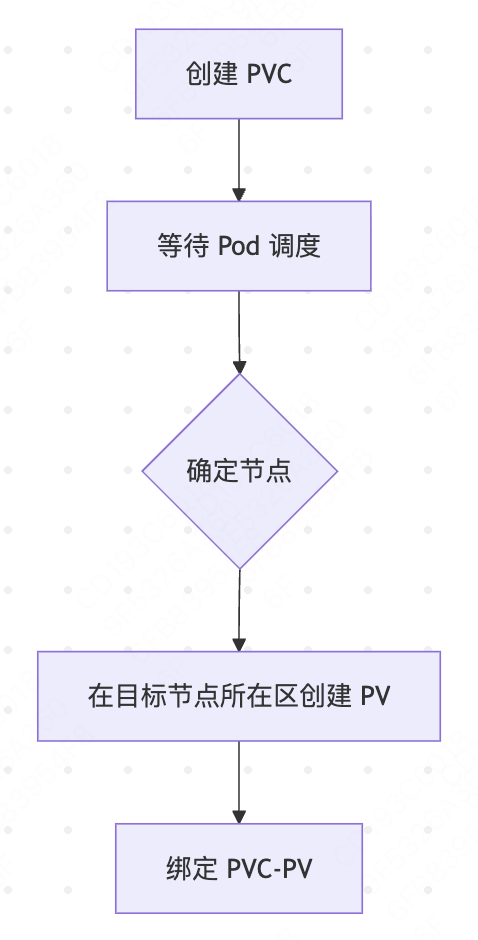
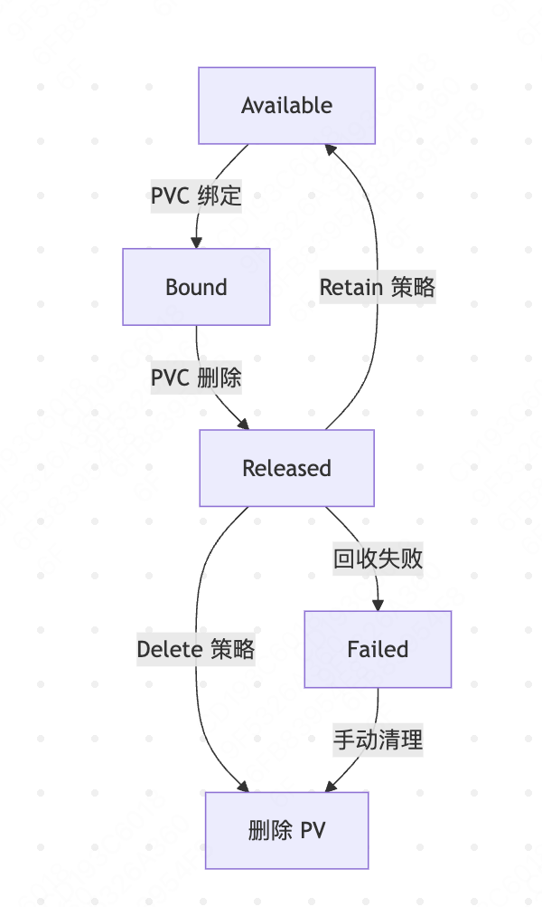
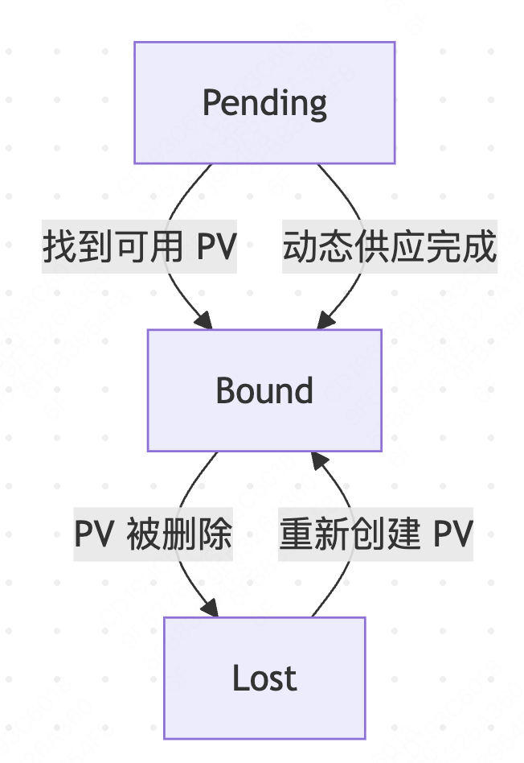

<!--Copyright © ZOMI 适用于[License](https://github.com/Infrasys-AI/AIInfra)版权许可-->

# K8S 容器持久化存储
Author by: 何晨阳，ZOMI

容器持久化存储是有状态服务容器化的基石，解决了临时存储无法满足数据持久性、共享性和高可用性的核心痛点。从以下三个视角可以看出其存在的必要性与合理性：
- **开发者视**：只需声明存储需求，无需关注底层实现。
- **运维视角**：自由更换存储后端（NFS/云盘/分布式存储）不影响业务。
- **核心价值**：实现应用与基础设施的关注点分离。

## 核心概念与架构
首先了解容器持久化相关的基础概念，主要包括一些概念的抽象。
### 存储抽象层
Kubernetes 的存储抽象层是解耦应用与底层存储基础设施的核心设计，其核心组件与逻辑关系如下：


### 核心组件关系
其中核心组件的角色、生命周期关系如下表所示：

| 组件 | 角色 | 生命周期 | 创建者 |
|------|------|----------|----------|
| PersistentVolume (PV) | 集群存储资源 | 独立于 Pod | 管理员/StorageClass |
| PersistentVolumeClaim (PVC) | 用户存储请求 | 与应用 Pod 关联 | 开发者 |
| StorageClass (SC) | 存储动态供应模板 | 集群级别长期存在 | 管理员 |

## 存储类型详解
为了支持不同存储介质，支持了多种不同的卷类型。

### 卷类型比较
Kubernetes 中主要存储卷类型的对比分析，主要特点、适用场景如下所示：

| 类型 | 特点 | 适用场景 | 示例 |
|------|------|----------|----------|
| 本地存储 | 高性能，节点绑定 | 临时缓存 | hostPath, emptyDir |
| 网络存储 | 跨节点共享 | 数据库/共享文件 | NFS, CephFS |
| 云存储 | 托管服务，高可用 | 云原生应用 | AWS EBS, GCP PD |
| 分布式存储 | 可扩展性强 | 大数据平台 | GlusterFS, Ceph RBD |

### 访问模式
Kubernetes 中存储卷的访问模式（Access Modes）定义了存储介质如何被节点（Node）或 Pod 挂载和使用。以下是核心访问模式的详细说明及适用场景：

| 类型 | 特点 | 适用场景 | 
|------|------|----------|
| ReadWriteOnce (RWO) | 单节点读写 | 块存储(EBS) | 
| ReadOnlyMany (ROX) | 多节点只读	 | 文件存储(NFS) |
| ReadWriteMany (RWX)	 | 多节点读写	 | 分布式存储(CephFS) | 

## Volume

Volume（存储卷） 是用于在容器之间或容器重启后持久化数据的抽象层。与 Docker 容器内的临时存储不同，k8s Volume 的生命周期与 Pod 绑定，而非单个容器，确保数据在容器重启、重建或跨容器共享时不丢失。

### 核心作用

- 数据持久化：容器重启后数据不丢失（容器本身的文件系统是临时的）。
- 跨容器共享：同一 Pod 内的多个容器可通过 Volume 共享数据。
- 集成外部存储：对接各种外部存储系统（如本地磁盘、云存储、分布式存储等）。
- 配置管理：通过 Volume 向容器注入配置文件（如 ConfigMap、Secret）。

### 临时卷类型
临时卷的使用说明、和场景示例如下所示：

| 类型 | 说明 | 场景示例 | 
|------|------|----------|
| emptyDir | Pod 创建时自动创建的空目录，存储在节点本地（内存或磁盘） | 容器间临时数据共享、缓存 | 
| configMap | 将 ConfigMap 中的配置数据挂载为文件	 | 应用配置注入 |
| secret	 | 类似 ConfigMap，但用于存储敏感数据（如密码、证书），数据会 base64 编码	 | 数据库密码、API 密钥挂载 | 
| downwardAPI	 | 将 Pod 或容器的元数据（如名称、IP）挂载为文件	 | 应用获取自身运行时信息 | 

### 持久化存储类（跨 Pod 生命周期）
以下是持久化存储类型及场景示例：

| 类型                          | 说明                                                                 | 场景示例                     |
|-------------------------------|----------------------------------------------------------------------|------------------------------|
| **persistentVolumeClaim (PVC)** | 通过 PVC 动态绑定 PersistentVolume (PV)，抽象存储细节                | 数据库数据持久化             |
| **hostPath**                  | 将节点本地磁盘路径直接挂载到 Pod (不推荐在生产环境使用)              | 开发测试、节点级日志存储     |
| **nfs**                       | 挂载 NFS (网络文件系统) 共享目录                                     | 跨节点数据共享               |
| **云厂商存储**                | 如 awsElasticBlockStore (AWS)、gcePersistentDisk (GCP)、azureDisk (Azure) | 云环境中持久化存储           |
| **分布式存储**                | 如 cephfs、glusterfs、rook (基于 Ceph)                              | 大规模分布式存储需求         |

### 特殊用途卷类型 csi

CSI（Container Storage Interface）是容器存储接口的标准，允许存储供应商编写插件来支持其存储系统。CSI 卷类型允许 Pod 使用任何符合 CSI 规范的存储驱动程序。

```yaml
apiVersion: v1
kind: Pod
metadata:
  name: csi-pod
spec:
  containers:
  - name: test-container
    image: nginx:1.20
    volumeMounts:
    - mountPath: /data
      name: csi-volume
  volumes:
  - name: csi-volume
    csi:
      driver: my-csi-driver
      volumeAttributes:
        storage.kubernetes.io/csiProvisionerIdentity: my-provisioner
```

## 持久化卷

### 核心概念

持久化卷实现存储资源的统一管理。

- PersistentVolume：PV 具有独立于 Pod 的生命周期，封装了底层存储实现的具体细节。
- PersistentVolumeClaim：类似于 Pod 消耗节点资源，PVC 消耗 PV 资源。用户通过 PVC 请求特定大小和访问模式的存储，无需了解底层存储实现。
- StorageClass：支持动态配置、不同的服务质量级别，并可定义配置参数和回收策略。

### 关键阶段说明

| 阶段           | 触发条件       | 系统行为             | 持续时间          |
|----------------|----------------|----------------------|-------------------|
| Provisioning   | PVC 创建        | 动态分配存储资源     | 秒级~分钟级       |
| Binding        | PVC 匹配 PV      | 建立绑定关系         | 瞬时完成          |
| Using          | Pod 挂载        | 数据读写操作         | 应用运行期        |
| Releasing      | PVC 删除        | 解除 PV 绑定           | 瞬时完成          |
| Reclaiming     | PV 释放         | 执行回收策略         | 依赖策略类型      |
| Recycling      | 回收完成       | 等待重新绑定         | 无限期            |

### 动态生命周期管理

StorageClass 控制机制
```yaml
apiVersion: storage.k8s.io/v1
kind: StorageClass
metadata:
  name: managed-premium
provisioner: kubernetes.io/azure-disk
reclaimPolicy: Delete # 核心回收策略
allowVolumeExpansion: true # 允许扩容
volumeBindingMode: WaitForFirstConsumer # 延迟绑定
parameters:
  skuname: Premium_LRS
```

延迟绑定(WaitForFirstConsumer)



卷扩容流程：


## 工作流程解析

静态配置指管理员手动创建 PV，而非通过 StorageClass 动态生成。CSI 在此场景中负责底层存储的挂载与卸载操作。流程如下：


动态配置指通过 StorageClass 和 PVC 自动创建并绑定 PV，无需管理员手动预配存储资源。流程如下：


## 关键配置详解

### StorageClass 示例

StorageClass 为管理员提供了描述和管理存储资源的标准化方法，使用示例如下：

```yaml
apiVersion: storage.k8s.io/v1
kind: StorageClass
metadata:
  name: fast-ssd
provisioner: kubernetes.io/aws-ebs
parameters:
  type: gp3
  fsType: ext4
  iops: "10000"
  throughput: "250"
reclaimPolicy: Delete
allowVolumeExpansion: true
volumeBindingMode: WaitForFirstConsumer
```

### PV/PVC 状态机
PV 的状态转换规则如下：
- Available → Bound：PVC 与 PV 的 storageClassName、accessModes、容量 匹配，且 PV 处于可用状态。
- Bound → Released：绑定的 PVC 被删除，且 PV 的 persistentVolumeReclaimPolicy 为 Retain。
触发操作：kubectl delete pvc <name>。
- Released → Available：管理员手动清理 PV（删除并重新创建相同配置的 PV）。
- Released → Failed：PV 回收策略为 Delete，但存储后端删除卷失败（如权限不足、网络故障）。
- Failed → 删除：管理员手动删除 PV。



PVC 的状态转换规则如下：
- Pending → Bound：找到匹配的 Available PV；StorageClass 的 Provisioner 成功创建 PV；PV 控制器完成绑定。
- Bound → Lost：条件：绑定的 PV 被手动删除或存储后端故障导致 PV 不可用。



## 高级特性

### 数据保护机制

卷快照
```yaml
apiVersion: snapshot.storage.k8s.io/v1
kind: VolumeSnapshot
metadata:
  name: db-snapshot
spec:
  volumeSnapshotClassName: csi-aws-vsc
  source:
    persistentVolumeClaimName: mysql-pvc
```

克隆技术：直接从快照创建新卷
数据迁移：跨集群/云厂商卷迁移

### 存储扩展

```bash
kubectl edit pvc my-pvc # 修改 storage 请求大小
```

拓扑感知：使用 volumeBindingMode: WaitForFirstConsumer
存储配额：限制命名空间存储用量

## 总结与思考
Kubernetes 存储系统通过抽象层设计与插件化架构，已成为云原生生态的核心支柱。其当前设计在灵活性、扩展性上表现突出，但面临性能优化、多租户安全等挑战。未来发展方向将聚焦于高性能（如 PMEM、NVMe-oF）、生态融合和安全合规。

## 参考与引用

- https://jimmysong.io/book/kubernetes-handbook/storage/volume/（Volume）
- https://jimmysong.io/book/kubernetes-handbook/storage/persistent-volume/（持久化卷）
- https://jimmysong.io/book/kubernetes-handbook/storage/storageclass/（）