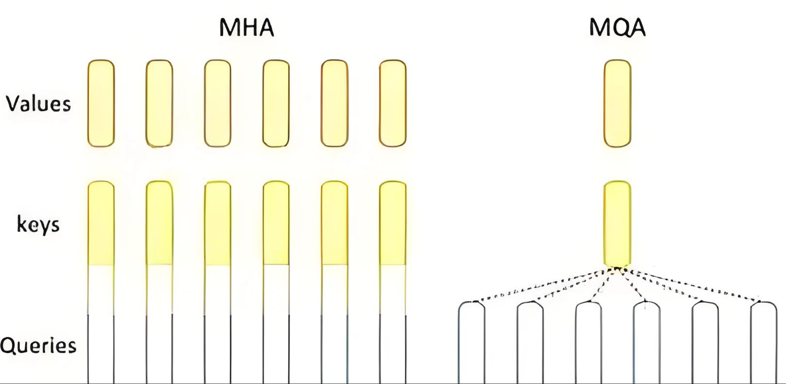
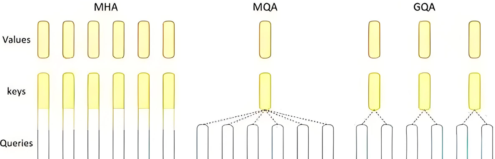
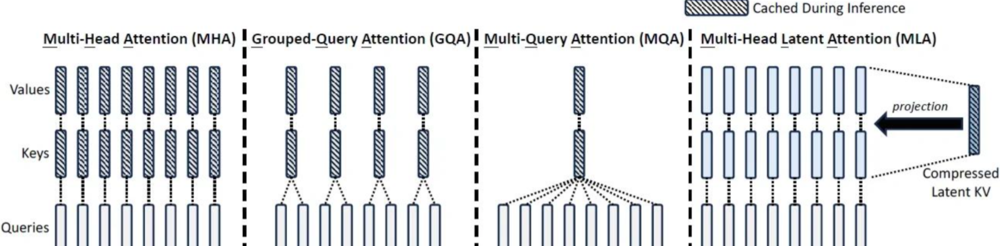

<!--Copyright © ZOMI 适用于[License](https://github.com/Infrasys-AI/AIInfra)版权许可-->

# 05.Attention 变种算法

> Author by:  张志达

!!!!!!!!!
内容太过于常规和简单，参考 PDF 和 PPT 里面的

## 1. MQA (Multi-Query Attention) 多查询注意力

### 1.1 简介



Multi-Query Attention (MQA) 是传统 Multi-Head Attention 的一种优化变体，它通过共享 Key 和 Value 矩阵来减少内存使用和计算复杂度，同时保持查询的多样性。

### 1.2 解决的问题

- **内存效率**：减少 KV 缓存的内存占用
- **计算效率**：降低注意力计算的时间复杂度
- **推理加速**：在生成任务中显著提升推理速度
- **资源优化**：在保持性能的同时减少模型参数量

### 1.3 数学表达

**在 MQA 中，多个 Query 头共享同一个 Key 和 Value 矩阵**：

$$
\begin{align*}
\text{MQA}(Q, K, V) &= \text{Concat}(\text{head}_1, \ldots, \text{head}_h) W^O \\
\text{其中}\quad \text{head}_i &= \text{Attention}(Q_i W_i^Q, K W^K, V W^V) \\
\text{Attention}(Q, K, V) &= \text{softmax}\left(\frac{Q K^T}{\sqrt{d_k}}\right) V
\end{align*}
$$

其中：
- $Q_i$：第 $i$ 个查询头
- $K, V$：共享的 Key 和 Value 矩阵
- $W_i^Q$：第 $i$ 个查询头的权重矩阵
- $W^K, W^V$：共享的 Key 和 Value 权重矩阵

### 1.4 伪代码实现

```python
def multi_query_attention(X, num_heads, d_model):
    """
    Multi-Query Attention 实现
    X: 输入序列 [seq_len, d_model]
    num_heads: 查询头数量
    d_model: 模型维度
    """
    d_k = d_model // num_heads
    
    # 为每个查询头创建 Q 的权重矩阵
    W_q = [random_matrix(d_model, d_k) for _ in range(num_heads)]
    
    # 共享的 K 和 V 权重矩阵
    W_k = random_matrix(d_model, d_k)
    W_v = random_matrix(d_model, d_k)
    
    # 计算共享的 K 和 V
    K = X @ W_k  # [seq_len, d_k]
    V = X @ W_v  # [seq_len, d_k]
    
    heads = []
    for i in range(num_heads):
        # 计算第 i 个查询头
        Q_i = X @ W_q[i]  # [seq_len, d_k]
        
        # 计算注意力分数
        scores = Q_i @ K.T  # [seq_len, seq_len]
        scores = scores / sqrt(d_k)
        
        # 应用 softmax
        attention_weights = softmax(scores)
        
        # 加权求和
        head_i = attention_weights @ V
        heads.append(head_i)
    
    # 拼接所有头的输出
    concat_heads = concatenate(heads, axis=-1)  # [seq_len, d_model]
    
    # 最终线性变换
    W_o = random_matrix(d_model, d_model)
    output = concat_heads @ W_o
    
    return output
```

## 2. GQA (Grouped-Query Attention) 分组查询注意力

### 2.1 简介



Grouped-Query Attention (GQA) 是 MQA 和传统 Multi-Head Attention 之间的折中方案，它将查询头分组，每组共享一个 Key 和 Value 矩阵，在性能和效率之间取得平衡。

### 2.2 解决的问题

- **平衡性能与效率**：在 MQA 和 MHA 之间找到最佳平衡点
- **灵活配置**：支持不同的分组策略
- **渐进优化**：可以逐步从 MHA 迁移到 MQA
- **任务适应性**：根据任务需求调整分组数量

### 2.3 数学表达

**在 GQA 中，查询头被分为 $G$ 组，每组共享 Key 和 Value**：

$$
\begin{align*}
\text{GQA}(Q, K, V) &= \text{Concat}(\text{head}_1, \ldots, \text{head}_h) W^O \\
\text{其中}\quad \text{head}_i &= \text{Attention}(Q_i W_i^Q, K_{g(i)} W_{g(i)}^K, V_{g(i)} W_{g(i)}^V) \\
g(i) &= \lfloor i / (h/G) \rfloor
\end{align*}
$$

其中：
- $G$：分组数量
- $g(i)$：第 $i$ 个查询头所属的组
- $K_{g(i)}, V_{g(i)}$：第 $g(i)$ 组共享的 Key 和 Value 矩阵

### 2.4 伪代码实现

```python
def grouped_query_attention(X, num_heads, num_groups, d_model):
    """
    Grouped-Query Attention 实现
    X: 输入序列 [seq_len, d_model]
    num_heads: 查询头数量
    num_groups: 分组数量
    d_model: 模型维度
    """
    d_k = d_model // num_heads
    heads_per_group = num_heads // num_groups
    
    # 为每个查询头创建 Q 的权重矩阵
    W_q = [random_matrix(d_model, d_k) for _ in range(num_heads)]
    
    # 为每个组创建共享的 K 和 V 权重矩阵
    W_k = [random_matrix(d_model, d_k) for _ in range(num_groups)]
    W_v = [random_matrix(d_model, d_k) for _ in range(num_groups)]
    
    # 计算每组的 K 和 V
    K_groups = []
    V_groups = []
    for g in range(num_groups):
        K_g = X @ W_k[g]  # [seq_len, d_k]
        V_g = X @ W_v[g]  # [seq_len, d_k]
        K_groups.append(K_g)
        V_groups.append(V_g)
    
    heads = []
    for i in range(num_heads):
        # 确定当前头所属的组
        group_id = i // heads_per_group
        
        # 计算第 i 个查询头
        Q_i = X @ W_q[i]  # [seq_len, d_k]
        
        # 使用对应组的 K 和 V
        K_g = K_groups[group_id]
        V_g = V_groups[group_id]
        
        # 计算注意力分数
        scores = Q_i @ K_g.T  # [seq_len, seq_len]
        scores = scores / sqrt(d_k)
        
        # 应用 softmax
        attention_weights = softmax(scores)
        
        # 加权求和
        head_i = attention_weights @ V_g
        heads.append(head_i)
    
    # 拼接所有头的输出
    concat_heads = concatenate(heads, axis=-1)  # [seq_len, d_model]
    
    # 最终线性变换
    W_o = random_matrix(d_model, d_model)
    output = concat_heads @ W_o
    
    return output
```

## 3. MLA (Multi-Latent Attention) 多潜在注意力

### 3.1 简介



Multi-Latent Attention (MLA) 是一种创新的注意力机制，它通过引入潜在变量来建模复杂的注意力模式，能够更好地捕捉序列中的长距离依赖和复杂关系。

### 3.2 解决的问题

- **长距离依赖**：更好地建模序列中的长距离关系
- **复杂模式捕捉**：通过潜在变量捕捉复杂的注意力模式
- **计算效率**：在保持表达能力的同时优化计算复杂度
- **可解释性**：提供更好的注意力模式可解释性

### 3.3 数学表达

MLA 通过潜在变量 $Z$ 来建模注意力分布：

$$
\begin{align*}
\text{MLA}(Q, K, V) &= \text{Concat}(\text{head}_1, \ldots, \text{head}_h) W^O \\
\text{其中}\quad \text{head}_i &= \text{Attention}(Q_i, K_i, V_i, Z_i) \\
\text{Attention}(Q, K, V, Z) &= \text{softmax}\left(\frac{Q K^T + Z}{\sqrt{d_k}}\right) V \\
Z &= \text{LatentModule}(Q, K)
\end{align*}
$$

其中：
- $Z$：潜在变量矩阵，用于建模复杂的注意力模式
- $\text{LatentModule}$：潜在变量生成模块
- 其他符号含义与标准注意力机制相同

### 3.4 伪代码实现

```python
def multi_latent_attention(X, num_heads, d_model, latent_dim):
    """
    Multi-Latent Attention 实现
    X: 输入序列 [seq_len, d_model]
    num_heads: 注意力头数量
    d_model: 模型维度
    latent_dim: 潜在变量维度
    """
    d_k = d_model // num_heads
    
    # 为每个头创建 Q, K, V 的权重矩阵
    W_q = [random_matrix(d_model, d_k) for _ in range(num_heads)]
    W_k = [random_matrix(d_model, d_k) for _ in range(num_heads)]
    W_v = [random_matrix(d_model, d_k) for _ in range(num_heads)]
    
    # 潜在变量生成模块的权重
    W_latent = [random_matrix(d_model, latent_dim) for _ in range(num_heads)]
    
    heads = []
    for i in range(num_heads):
        # 计算 Q, K, V
        Q_i = X @ W_q[i]  # [seq_len, d_k]
        K_i = X @ W_k[i]  # [seq_len, d_k]
        V_i = X @ W_v[i]  # [seq_len, d_k]
        
        # 生成潜在变量
        latent_features = X @ W_latent[i]  # [seq_len, latent_dim]
        Z_i = latent_features @ latent_features.T  # [seq_len, seq_len]
        
        # 计算注意力分数（加入潜在变量）
        scores = Q_i @ K_i.T  # [seq_len, seq_len]
        scores = scores + Z_i  # 加入潜在变量
        scores = scores / sqrt(d_k)
        
        # 应用 softmax
        attention_weights = softmax(scores)
        
        # 加权求和
        head_i = attention_weights @ V_i
        heads.append(head_i)
    
    # 拼接所有头的输出
    concat_heads = concatenate(heads, axis=-1)  # [seq_len, d_model]
    
    # 最终线性变换
    W_o = random_matrix(d_model, d_model)
    output = concat_heads @ W_o
    
    return output

def latent_module(X, latent_dim):
    """
    潜在变量生成模块
    X: 输入特征 [seq_len, d_model]
    latent_dim: 潜在变量维度
    """
    # 简单的线性变换作为潜在变量生成
    W_latent = random_matrix(X.shape[-1], latent_dim)
    latent_features = X @ W_latent
    
    # 可以添加更复杂的非线性变换
    # latent_features = relu(latent_features)
    
    return latent_features
```

## 4. 三种注意力机制对比

| 特性 | MQA | GQA | MLA |
|------|-----|-----|-----|
| **KV 缓存占用** | 显存占用低(仅需 1 组 KV 缓存) | 显存占用低于 MHA, 但高于 MQA(分组共享 KV cache) | 显存占用显著降低(低秩压缩) |
|**计算复杂度**|最低(共享 KV 计算)|中等(分组共享 KV 计算)|低于 MHA 和 GQA(低秩空间计算)|
|**模型效果**|略低于 MHA(共享 KV 导致信息损失)|接近 MHA(分组共享平衡性能效率)|接近 MHA(低秩压缩保留关键特征)|
|**应用模型**|Falcon 系列模型|LLaMA-2/LLaMA-3、Qwen3|DeepSeek-V3、Kimi-K2|

## 总结与思考

!!!!!!!!!

## 本节视频

<html>
<iframe src="https://player.bilibili.com/player.html?isOutside=true&aid=114682388093947&bvid=BV1GzMUz8Eav&cid=30498491822&p=1&as_wide=1&high_quality=1&danmaku=0&t=30&autoplay=0" width="100%" height="500" scrolling="no" border="0" frameborder="no" framespacing="0" allowfullscreen="true"> </iframe>
</html>

## 参考与引用

!!!!!!!!!加入参考的文章和内容