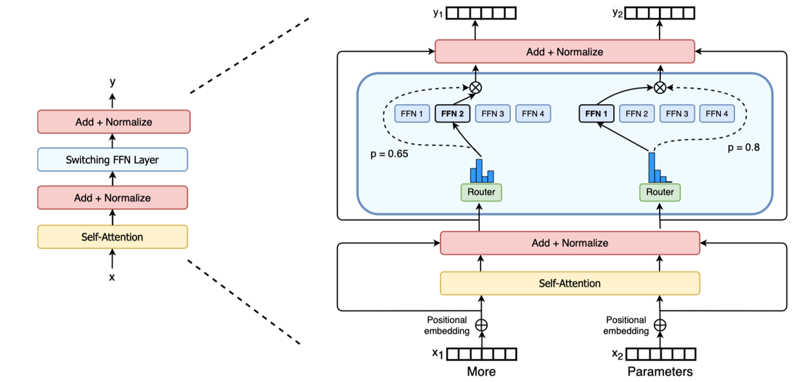

<!--Copyright © ZOMI 适用于[License](https://github.com/chenzomi12/AIInfra)版权许可-->

# Switch Transformer 解读

Author by: 张晓天

2022年4月，距离ChatGPT发布还有半年，Google再次发布里程碑式工作《Switch Transformers: Scaling to Trillion Parameter Models with Simple and Efficient Sparsity》。该研究基于T5（Encoder-Decoder）架构，成功训练出参数量高达**1.6万亿（1.6T）**、包含**2048个专家**的稀疏模型。Switch Transformer的核心论点是：**模型参数量应被视为一个独立于计算量的全新缩放维度**。

Switch Transformer所做的工作还是比较多的，包括：

1. 模型结构简化：简化了Transformer上的MoE架构，提出Switch Transformer架构。
2. MoE to dense：把训出来的效果较好的MoE模型蒸馏到dense模型，在压缩MoE模型99%的参数的情况下，效果还是比直接训练dense模型好。
3. 训练和微调技术：首次使用bf16成功训练MoE模型；更适合MoE结构的模型初始化；增加的专家正则化，改善了稀疏模型的微调和多任务训练。
4. 训练框架：结合数据、模型和专家并行性，训练了超过1T参数的MoE模型。
5. 多语言：在多语言数据集上训练，发现101种语言效果普遍有提升。
6. 训练效率：在同样的FLOPS/token的计算量下，Switch Transformer模型收敛速度有数倍的提升。

本节将详细介绍其核心创新与技术细节，并总结其对未来的深远影响。

## 模型参数量作为独立的缩放轴

传统模型缩放面临一个根本性约束：模型性能的提升往往依赖于参数量的增加，而这又会直接导致训练和推理的计算成本（FLOPS）线性增长。

Switch Transformer提出了一个突破性的观点：**通过稀疏MoE模型，可以将模型参数量（Model Size）从一个与计算量（FLOPS）强耦合的变量，转变为一个独立的、可单独扩展的维度**。

这意味着，我们可以在**保持每令牌计算量（FLOPS/token）几乎不变**的前提下，**极大地增加模型的总参数量**，从而获得更好的模型性能。如下图所示，其目标是在相同的计算预算（横轴）下，通过增加参数量（从蓝色曲线切换到红色曲线），达到更优的性能（纵轴）。

```text
Performance │
            │   --- Switch Transformer (Large Params, Fixed FLOPs)
            │  /
            │ /
            │/_____
            ├─────────────────────> FLOPs/token
           Dense Model (Coupled Params & FLOPs)
```

这一思想为大模型的发展提供了新的方向：不再仅仅追求更大的算力，而是通过算法和架构创新，更智能地利用算力，将计算资源用于扩大模型的“知识容量”而非“瞬时计算强度”。

## 模型设计

与GShard等先前采用Top-2路由的策略不同，Switch Transformer做出了一个大胆而关键的决定：**将路由专家数量简化至Top-1**。即，每个输入令牌（Token）只被路由到**唯一一个**最合适的专家（Expert）进行处理。



这种简化带来了多重优势：

* **计算效率**：门控网络（Router）的计算量减半，只需计算一个最大值的索引。
* **通信效率**：在分布式训练中，All-to-All的通信量降低为原来的1/k（k为专家数），极大地减少了设备间的通信瓶颈，这是实现超大规模扩展的关键。
* **实现简单**：模型逻辑更加清晰，易于实现和调试。

### 专家容量与负载均衡

与GShard一脉相承，Switch Layer引入了**专家容量（Expert Capacity）** 的概念。每个专家在一次前向传播中能处理的令牌数有一个上限，由**容量因子（Capacity Factor）** `C` 控制。

* 专家容量 = `(批次中的令牌数 * C) / 专家数量`
* 如果`C=1.0`，则容量等于完美均衡时的平均值。
* 实践中会设置一个略大于1的`C`（如1.1-1.25），以提供一个小的缓冲空间，减少令牌溢出的概率。

当一个令牌被路由至一个已经达到其容量上限的专家时，即发生**溢出（Overflow）**。这些溢出的令牌将**不会被任何专家处理**，而是直接通过**残差连接**原封不动地传递至下一层。论文强调，**低的溢出率是模型成功缩放的关键**，因为高的溢出率意味着大量信息丢失，会严重损害模型性能。

Top-1路由虽然高效，但也更容易引发负载不均衡问题（少数专家处理所有任务，多数专家被闲置）。为此，Switch Transformer设计了一种高效的**辅助损失函数（Auxiliary Loss）**——**负载均衡损失**。

其设计目标是鼓励所有专家在一批数据中获得大致相等的重要度（即门控权重之和）。损失函数如下：
$L_balance = α * E * sum_i (f_i * P_i)$
其中：

* $E$是专家总数。
* $f_i$是第i个专家在一批数据中获得的门控权重总和（即“重要性”）。
* $P_i$是第i个专家在一批数据中实际接收到的令牌数量的比例（即“负载”）。
* $α$是一个超参数，用于控制均衡损失的强度。

该损失函数的核心思想是**最小化专家重要性$f_i$与专家负载$P_i$之间的协方差。当所有专家既重要又承担均衡的负载时，损失最小。通过将此损失与主任务损失加权求和，共同参与梯度下降，模型能够自发地学习到一种均衡的路由策略，这是Switch Transformer能在极简路由下稳定训练的核心保障。

## 系统与工程创新

### 模型蒸馏

虽然MoE模型在训练和推理时计算效率高（FLOPS/token低），但其**内存占用**依然与总参数量成正比。一个拥有万亿参数的模型，即使每次只激活几十亿参数，也需要将所有参数加载到内存中。蒸馏的目的就是将巨型稀疏模型中学到的“知识”，压缩到一个更小、更易部署的稠密模型中。

将预训练好的巨型Switch Transformer（教师模型）的知识，蒸馏到一个参数少得多的普通Dense Transformer（学生模型）中。学生模型的训练目标是同时最小化与真实标签的交叉熵（硬损失）和与教师模型输出的KL散度（软损失）。

论文发现，蒸馏得到的稠密模型（例如，从1.6T参数蒸馏到11B参数）的性能，**显著优于直接使用相同数据训练的同规模（11B）稠密模型**。这证明了MoE模型的核心价值：它不仅是一个高效的推理架构，更是一个**更强大的“知识容器”**。大规模稀疏预训练的过程，其本质是让模型在极其庞大的参数空间中学到了更丰富、更鲁棒的表征和规律。

### **训练稳定性**

传统FP16精度范围小，在训练深度模型时容易因梯度 underflow/overflow 而失败。**bfloat16**提供了与FP32相同的指数范围，但保持了16位的存储大小。成功使用bfloat16是稳定训练的关键，它避免了数值溢出，同时减少了内存占用和通信开销。

如果初始化门控网络不当，在训练初期某些专家可能获得极大的权重，导致“赢家通吃”，破坏负载均衡。论文中采用了更小的初始化标准差（例如，截断正态分布 with `stddev=1.0`），并尝试将Router的权重初始化为零，以确保训练初期路由尽可能均匀。

超大MoE模型，在微调阶段容易过拟合特定下游任务，导致性能下降。论文引入了**更大的dropout比率**。在MoE层中，不仅在稠密部分使用dropout，在**Router的输出（专家权重）上也应用了dropout**。这强制模型不能过度依赖少数几个专家，必须保持一种冗余和鲁棒性。这项技术显著改善了模型在多任务学习和下游任务微调时的泛化能力。

### 多维并行训练

训练万亿模型无法依靠单一并行策略，必须进行多维融合。Switch Transformer的结合策略如下：

1. 数据并行（Data Parallelism）：将大批次数据分割到多个核心（如TPU/GPU）上，每个核心拥有完整的模型副本，独立计算梯度，最后同步聚合。
2. **模型并行（Model Parallelism）**：当单个层的参数量太大，无法存于一个设备时（如巨大的FFN层），将**单个专家**的参数拆分到多个设备上。
3. **专家并行（Expert Parallelism）**：这是MoE的核心并行策略。将**不同的专家**放置在不同的设备上。当一个MoE层的前向传播开始时，所有令牌通过All-to-All通信被发送到其对应专家所在的设备上进行计算，计算完成后再通过另一个All-to-All通信将结果送回。

Switch Transformer的创新在于**无缝融合了这三种并行范式**。

## 小结

Switch Transformer是MoE发展史上的一个决定性瞬间。它在T5（encoder-decoder）基础上，简化 routing 策略，实现 1.6T 参数量，并论证了“参数量作为独立缩放轴”的革命性思想。

其特点源于多个层面的协同创新：

* **算法层面**：大胆的Switch（Top-1）路由和精心设计的负载均衡损失。
* **系统层面**：对专家容量、通信、并行策略的深度优化。
* **工程层面**：在训练稳定性、精度、蒸馏等方面的一系列实践技巧。

Switch Transformer直接启发了后续一系列重要工作，为GPT-3.5、GPT-4等超大模型的技术路径埋下了伏笔。

## 本节视频

<html>
<iframe src="https://player.bilibili.com/player.html?isOutside=true&aid=114042236575649&bvid=BV1UsPceJEEQ&cid=28508818999&p=1&as_wide=1&high_quality=1&danmaku=0&t=30&autoplay=0" width="100%" height="500" scrolling="no" border="0" frameborder="no" framespacing="0" allowfullscreen="true"> </iframe>
</html>
